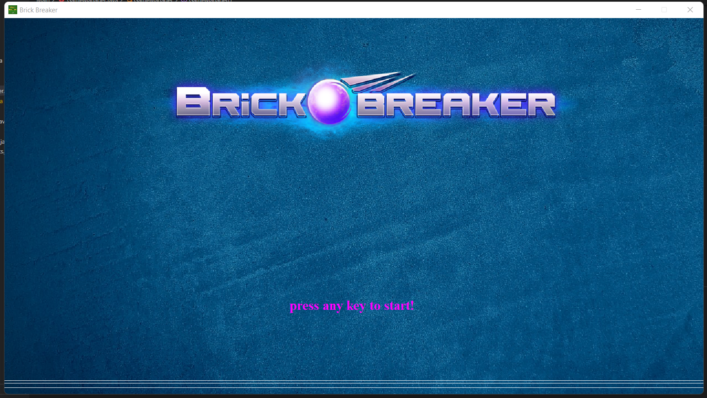
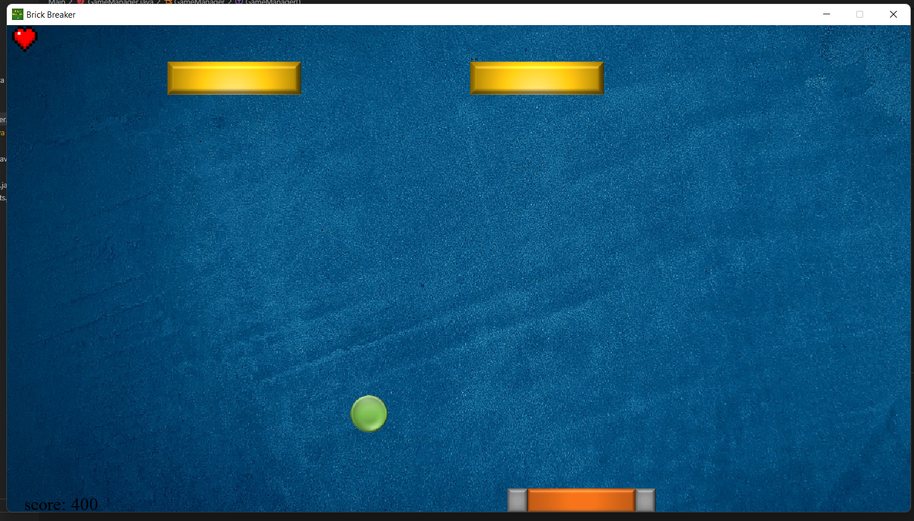
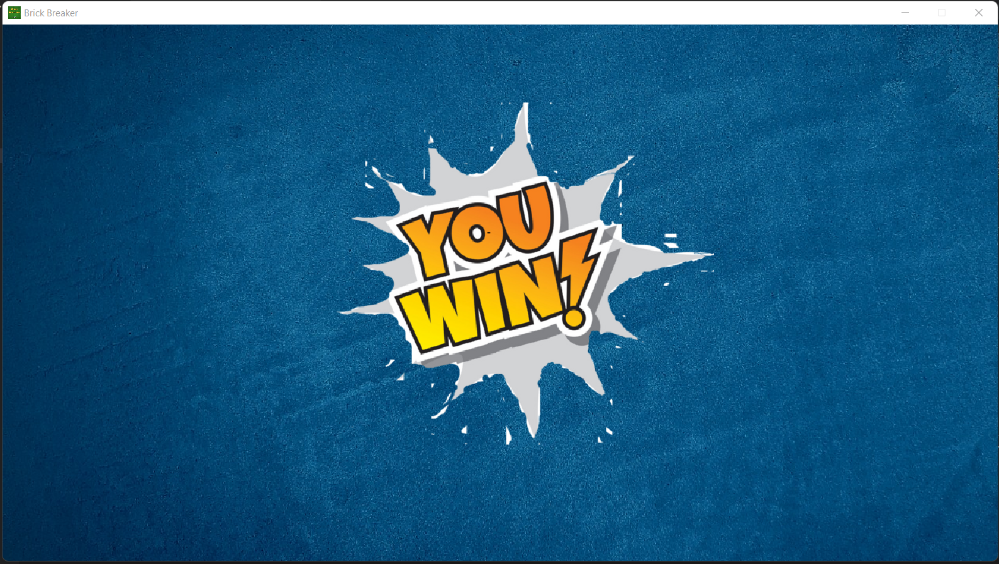
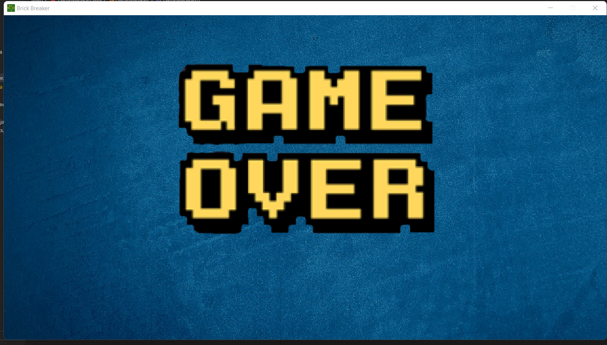

# Brick Breaker Game - Written in java

> The Project is a tramdinial brick breaker game, you need to break all the bricks with the ball and the paddle!🧱.

## Table of contents
* [General info](#general-info)
* [Technologies](#technologies)
* [Features](#features)
* [Screenshots](#screenshots)
* [Setup](#setup)
* [Project Status](#project-status)
* [Acknowledgements](#acknowledgements)
* [Contact](#contact)

## General info
- You start the game with 3 life point(it's changeable in the code, hearts as life point❤️) and evey brick you break you get a 100 points(it's changeable in the code)💯. 
	
## Technologies
Project is created with:
* Visual studio code
* Java SE17
* Utilities library - Scanner.
* Swing library - Timer, JFrame, JLabel, JButtom, ImageIcon.
* AWT library - KeyListener, Action listener, KeyEvent, ActionEvent, GridBagLayout. Rectangle, Dimension, Font, Color.
* Javax library - sound, sample, AudioInputStream, AudioSystem, Clip.
* Io library - File, paths.

## Features
- Most of the parameters are adjustable, for instance: ball speed, lifepoints, Screen resolution.

## Screenshots
> Start menu of the game.

> Example of the Gameplay.

> Example of "Winning" screen.

> Example of "Gameover" screen.

## Setup
1. First download all the folders.
2. Open Gamemanager.java file in your java IDE.
3. Enjoy!

## Project Status
The project is completed but probably will not get updated, because it was part of a course i took, and i moved on in the course to expand my knowledge⚡.

### Known issues
* Sometimes if you hit the brick sides the ball will be returned like it was hit the bottom of the brick.

## Acknowledgements
I would want to thank CampusIL and the team behind the "Object oriented programing" course!
> Link to the course home page [here](https://campus.gov.il/course/huji_acd_rfp4_huji_oop/)

## Contact
Created by Oshri Agronov, feel free to contact me!:v:
