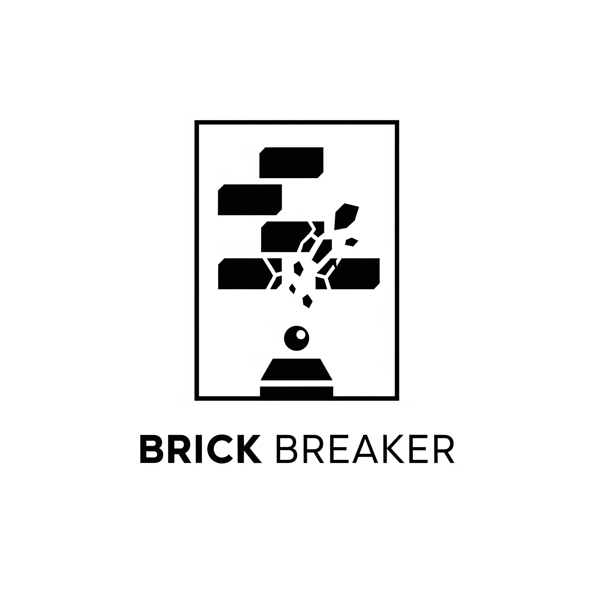

<h1 align="center">The game is under overhaul progress!, for now the game unplayable.</h1>

<br />
<div align="center">
  <a href="https://github.com/oshriagronov/brick-breaker">
    
  </a>
<h3 align="center">Brick Breaker</h3>
  <p align="center">
    Traditional brick breaker game where the player needs to break all the bricks with the ball and the paddle surface.
  </p>
</div>

## About

This project is a classic Brick Breaker game developed in Java. The game was built from the ground up, utilizing the javax.swing and java.awt libraries to handle the graphical user interface and event-driven programming.<br/>
This implementation demonstrates a solid understanding of object-oriented principles and game loop mechanics, providing a fun and engaging user experience while showcasing the capabilities of Java for desktop applications.

### Key features

- Parameters are customizable: ball speed, life points, Screen resolution.
- Life points system.
- Score system.

## Technologies Used

- Java SE17.
- Utilities library - Scanner.
- Swing library.
- AWT library.
- Javax library.
- Io library.

## Media

> Start menu.
> 

> Gameplay screen.
> 

> "Winning" screen.
> 

> "Gameover" screen.
> 

## Getting Started

To get a local copy up and running follow these simple steps.

### Prerequisites

- Linux, MacOS or Windows
- IDE with java

### Installation

---

1. **Clone and enter the Magnetron repository:**

   ```bash
   git clone https://github.com/oshriagronov/brick-breaker && cd brick-breaker
   ```

2. **Open the brick-breaker folder in your IDE**

3. **Run Gamemanager.java file!**

### Known issues

- Sometimes if you hit the brick sides the ball will be returned like it was hit the bottom of the brick.
- The only way to replay the game is to close the game and run again.
- The number of bricks depends on screen resolution(the higher the resolution the more bricks will be and vice versa).

## Acknowledgements

I would like to thank CampusIL and the team behind the "Object oriented programming" course!

> Link to the course home page [here](https://campus.gov.il/course/huji_acd_rfp4_huji_oop/)
